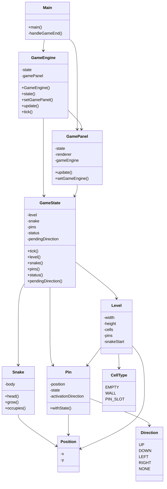

# UML-Klassendiagramm LockSnake

## Kurze Analyse

`Main` startet das Spiel und verbindet `GameEngine` mit `GamePanel`.

`GameEngine` verwaltet den aktuellen Spielzustand. Sie reagiert auf Tastatureingaben und führt bei jedem Timer-Schritt einen neuen Spielschritt aus.

`GameState` enthält die eigentliche Spiellogik. Dort wird geprüft, ob die Schlange sich bewegt, gegen eine Wand läuft, aus dem Spielfeld fällt, sich selbst trifft oder einen Pin aktiviert.

`GamePanel` zeigt den Spielzustand an. Wenn sich der Zustand ändert, bekommt das Panel den neuen `GameState` und zeichnet das Spielfeld neu.

Die Modellklassen `Level`, `Snake`, `Pin`, `Position`, `Direction` und `CellType` beschreiben die Daten des Spiels.
